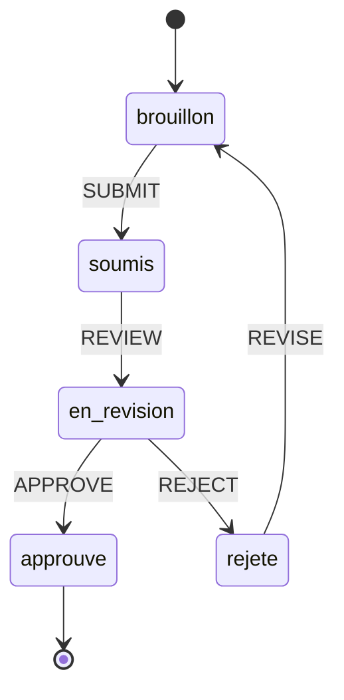

# ADR 0002: Moteur de Workflow

## Statut

Différé - À réévaluer en Phase 2

## Contexte

Plusieurs processus métier dans SUTEL Nexus impliquent des états multiples et des transitions complexes :

1. **Soumissions de contenu** : brouillon → soumis → en_revision → approuvé/rejeté
2. **Validation de documents** : upload → validation_format → validation_contenu → publié
3. **Synchronisation externe** : pending → syncing → success/conflict/failed
4. **Modération forum** : signalé → en_examen → action/classé

Actuellement, ces workflows sont implémentés de manière implicite dans les hooks et services.

## Problèmes Identifiés

1. **Transitions dispersées** : Logique répartie dans plusieurs fichiers
2. **États incohérents** : Possibilité de transitions invalides
3. **Testabilité limitée** : Difficile de tester les machines d'état
4. **Traçabilité manquante** : Pas d'historique des transitions

## Options Évaluées

### Option 1: XState (Machine d'État Formelle)

```typescript
import { createMachine } from 'xstate';

const submissionMachine = createMachine({
  id: 'submission',
  initial: 'draft',
  states: {
    draft: { on: { SUBMIT: 'submitted' } },
    submitted: { on: { REVIEW: 'in_review' } },
    in_review: { 
      on: { 
        APPROVE: 'approved',
        REJECT: 'rejected'
      }
    },
    approved: { type: 'final' },
    rejected: { on: { REVISE: 'draft' } }
  }
});
```

**Avantages :**
- Visualisation des états
- Transitions garanties valides
- Excellente testabilité
- Support TypeScript natif

**Inconvénients :**
- Dépendance supplémentaire (~15kb)
- Courbe d'apprentissage
- Overhead pour cas simples

### Option 2: Machine d'État Maison + Zod

```typescript
import { z } from 'zod';

const SubmissionStatus = z.enum(['draft', 'submitted', 'in_review', 'approved', 'rejected']);

const transitions: Record<string, string[]> = {
  draft: ['submitted'],
  submitted: ['in_review'],
  in_review: ['approved', 'rejected'],
  rejected: ['draft']
};

function canTransition(from: string, to: string): boolean {
  return transitions[from]?.includes(to) ?? false;
}
```

**Avantages :**
- Pas de dépendance nouvelle
- Simple à comprendre
- Léger

**Inconvénients :**
- Moins de fonctionnalités
- Pas de visualisation
- Maintenance manuelle

### Option 3: Statu Quo (Pas de changement immédiat)

Garder l'implémentation actuelle, documenter les workflows, et réévaluer quand la complexité augmente.

## Décision

**Différer l'implémentation d'un moteur de workflow formel.**

Raisons :
1. Les workflows actuels fonctionnent (pas de bugs critiques)
2. Priorité aux corrections de typage (LOT 1)
3. Besoin de stabiliser avant d'ajouter de la complexité
4. Évaluer le ROI avec des métriques réelles

## Plan d'Action

### Court terme (maintenant)

1. Documenter les workflows existants dans des diagrammes Mermaid
2. Ajouter des validations de transition dans les services
3. Logger les transitions pour analyse

### Moyen terme (Phase 2)

1. Évaluer XState sur un workflow pilote (soumissions)
2. Mesurer l'impact sur la maintenabilité
3. Décider de généraliser ou non

### Critères de Déclenchement

Implémenter un moteur formel si :
- Plus de 5 états par workflow
- Bugs fréquents liés aux transitions
- Besoin de visualisation pour debug
- Nouveaux workflows complexes ajoutés

## Workflows Candidats (Priorité)

1. **Soumissions** (5 états) - Candidat prioritaire
2. **Synchronisation** (4 états) - Critique mais technique
3. **Modération** (4 états) - Utilisateurs multiples
4. **Validation docs** (5 états) - Intégration externe

## Références

- [XState Documentation](https://xstate.js.org/)
- [State Machines in React](https://kentcdodds.com/blog/implementing-a-simple-state-machine-library-in-javascript)

## Diagramme Actuel (Soumissions)


